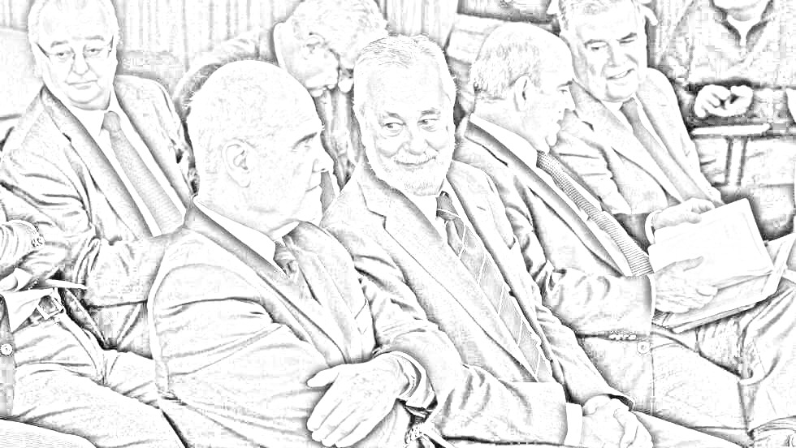

# PROJECT: several screens mockup

## Task
Design some mockup screens with a vector tool (Sketch, Adobe XD or Balsamiq)

It all has to be editable and translatable.

The look and feel should appear hand drawn (à la balsamiq)

All screens are of a proportion of 4:3

All screens share a common interface:

- Header
	- First line
		- Hamburguer menu in the top left corner
		- A horizontal logo [next to the hamburguer]
		- Profile icon in the top right corner
	- Second line
		Page Title
- Body
	Page contents [this is what changes]
- Footer

This is the logo:


There are 11 screens total:

1.- EASY: Main menu with 5 big buttons

2.- COMPLEX: a 3 column screen with 2 datatables of texts and a list of tweets/fb posts

3.- COMPLEX: 4 section screen with 2 datatables, a news article and an edit area

4.- MEDIUM: 2x2 grid with 4 different tiles: datatable, map, timeline and chart

5.- MEDIUM: 3 section scren with one image, one textarea and a form

6.- MEDIUM: A datatable and a form

7.- EASY: A form and a supplied image

8.- EASY: Just a supplied image

9.- MEDIUM: A list and a form

10.- MEDIUM: A list and a form

11.- MEDIUM: A list and a form

---

## Screen 1

Title: **Iberian Seeds**

Contents: A main menu with big buttons and the following options:

```ruby

1. iberianseeds.today [icon: news]

2. iberianseeds.app [icon: smartphone]

3. iberianseeds.social [icon: network]

4. iberianseeds.tv [icon: tv]

5. iberianseeds.wiki [icon: books]

```

---

## Screen 2

Title: **iberianseeds.today**

Layout: three columns

Contents:

### Screen 2 Column 1 Section 1

```Ruby
November 10, 2019
```

### Screen 2 Column 1 Section 2

MOTD [Message of the day, a long message cropped to 3 lines and with a button to expand]

Contents:

```
Today, we speak about:

"Lorem ipsum dolor sit amet, consectetur adipiscing elit, sed do eiusmod tempor incididunt ut labore et dolore magna aliqua. Eget est lorem ipsum dolor sit. Faucibus turpis in eu mi bibendum neque egestas. Parturient montes nascetur velit laoreet id donec ultrices (...)" [button to expand or read more]
```

### Screen 2 Column 1 Section 3

Contents:

```
Previsiones

08:00 RNE Cuca Gamarra - Mañanas
08:30 COPE Pablo Montesinos - Herrera
09:00 SER Teo G.E. - Es la radio
10:30 ONDA0 🔥Pablo Casado 🔥- Buenos días
14:00 RTVE Isabel G.T. - Directo Hoy
(…)
```
[button to expand or read more]

### Screen 2 Column 2

List of newspaper headlines

```
NACIONAL

🔴 (OKD) Iglesias exige a Sánchez hacer (…)
🔴 (OKD) El PSC vota con los separatistas (…)
🔴 (CONFI) Las claves del juicio de los ERE  (…)
🔴 (CONFI) No a la caza y apagón nuclear (…)
📊 (ESPA) Vox y Podemos fueron los partidos  (…)
🔴 (ESPA) Los mensajes escondidos que Sánchez (…)
🔴 (VOZPO) Iglesias calma las sospechas de (…)
📝 (VOZPO) "El PSOE es especialista en quebrar (…)
🔴 (VOZPO) La llegada al gobierno encumbra a (…)
🔴 (INDEP) La abstención patriótica divide al  (…)

OPINION

🗞 (ABC) El PS, por Luis Ventoso
📰 (ABC) El candado flojo, por Ignacio Camacho
📇 (ABC) Una última oportunidad, por España; Editorial

AUTONÓMICA
🟢 (LV) Titular de la noticia (…)
(…)

PROVINCIAL
🟡 (PROV) Titular de la noticia (…)
(…)

LOCAL
🔵 (LOCAL) Titular de la noticia (…)
(…)

```

### Screen 2 Column 3

List of social networks links

- Some tweets
- Some FB posts
- Some IG posts

---

## Screen 3

Title: **Press Center**

Layout: Grid w/ 4 sections

```text
+-----------+-----------+-----------+
|           |           |           |
|           |           |           |
|           |     2     |     3     |
|           |           |           |
|           |           |           |
|     1     +-----------+-----------+
|           |                       |
|           |                       |
|           |           4           |
|           |                       |
|           |                       |
+-----------+-----------------------+
```

### Screen 3 Column 1

List of news headlines

```
🔴 Iglesias exige a Sánchez hacer
🔴 El PSC vota con los separatistas
🔴 Las claves del juicio de los ERE
🔴 No a la caza y apagón nuclear
🔴 Vox y Podemos fueron los partidos  
🔴 Los mensajes escondidos que Sánchez
🔴 Iglesias calma las sospechas de
🟢 La llegada al gobierno encumbra a
🟢 La abstención patriótica divide al  
🟡 Titular uno de la noticia
🟡 Titular dos de la noticia
🔵 Titular tres de la noticia
🔵 Titular cuatro de la noticia
```

### Screen 3 Section 2

Datatable of versions

```
+----------------------------------+
| Las claves del juicio de los ERE |
+==================================+
| ABC                              |
| El Pais                          |
| El Mundo                         |
| La Razón                         |
| La Vanguardia                    |
| El Periódico                     |
| Confidencial                     |
| Confidencial Digital             |
| OK Diario                        |
+----------------------------------+
```

### Screen 3 Section 3

Edit area

An editable text area with 3 checks and a POST button

A thumbnail for an image


3 checks with 3 logos for TW, FB & IG

### Screen 3 Section 4

News full text and image

Image to the right




Headline "Las claves del juicio de los ERE"

Full text (as much as needed):

_Lorem ipsum dolor sit amet, consectetur adipiscing elit. Maecenas interdum leo et tellus sagittis sollicitudin. Sed vitae lectus sit amet urna tincidunt euismod non at magna. In hac habitasse platea dictumst. Suspendisse potenti. Aliquam eget condimentum lectus. Duis mattis risus non urna lobortis, sit amet mollis felis porta. Cras tincidunt malesuada tortor. Nunc ultricies nisi augue, eget ornare tellus euismod eu._

_Nulla facilisi. Sed vitae nulla vel leo ornare mattis vel sit amet purus. Suspendisse sit amet condimentum purus. Curabitur a tellus vitae nunc lobortis facilisis. Maecenas id iaculis augue. Integer tellus diam, ullamcorper at nunc non, vestibulum pulvinar lorem. Phasellus eget nibh elit. Sed congue ultrices purus eget aliquam. Donec vitae mauris eget arcu tempus accumsan. Maecenas id fringilla odio. Cras tempor et enim ac mollis._

_Nam tristique maximus tellus, vitae faucibus est ornare vel. Proin et hendrerit magna. Pellentesque id nunc at mauris porttitor malesuada in non arcu. Phasellus et arcu ac odio ultrices venenatis. Quisque blandit vestibulum cursus. Pellentesque malesuada non magna at hendrerit. Cras iaculis eros eu quam luctus finibus._

_Proin ac tincidunt odio. Proin pulvinar viverra pharetra. Cras in auctor lorem, congue consectetur leo. Nulla nisi velit, lobortis ut commodo ac, consequat eget libero. Praesent a quam ut ipsum semper vehicula. In pharetra ullamcorper bibendum. Quisque magna augue, condimentum ac enim sit amet, porttitor lacinia odio. Duis fermentum lacinia lobortis. Proin feugiat, leo at consequat condimentum, quam tellus cursus sapien, id efficitur quam arcu a lacus. Curabitur vehicula est sapien, et luctus metus porta et._

---

## Screen 4

Title: **iberianseeds.app**

Layout: a 2x2 grid

### Screen 4 Section 1

Title: **Planificación**


A random Gantt chart that looks hand drawn (you may even hand draw it and photo it).

Use the following words in the bars:

```
Granada
Pontevedra
Soria
Alicante
Badajoz
Canarias
```

### Screen 4 Section 2

Title: **Reuniones**

A dropdown displaying the option "Enfermeria"

Adate input with a calendar icon with "NOV'19" selected

A vector map of Spain with a marker cluster in some provinces with random numbers (between 10 and 50)


The markers should look hand drawn (not like this shown below, just a reference)


### Screen 4 Section 3

A datatable

```

+-------+--------+-------+-------+----------------------------------------------------+
| Nivel | Sector | Dueño | Flags |                       Mocion                       |
+=======+========+=======+=======+====================================================+
| NAC   | ECO    | PS    | ↑     | para impulsar compromisos responsables sobre verti |
| NAC   | VAR    | PP    | ↑     | para invitar a todos los grupos municipales a los  |
| CyL   | EDU    | Cs    | ↓     | para implementar proyectos de educación para esco  |
| CLM   | VIV    | UP    | ⇩     | crear un “Observatorio de la vivienda”             |
| CAT   | ACC    | PP    | ⬆︎    | para reducir las barreras arquitectónicas          |
| LAR   | POL    | UP    | 🔥    | para garantizar el principio de aconfesionalidad r |
| MAD   | SAN    | PP    |       | para promocionar entre la población las ventajas   |
| +++   | POL    | PS    |       | para la recuperación de la Memoria Histórica, en   |
| BUR   | CUL    | PP    |       | Para mejorar la protección y visibilidad de la     |
+-------+--------+-------+-------+----------------------------------------------------+

```

### Screen 4 Section 4

Chart


---

## Screen 5

Title: **iberianseeds.social**

Layout:

```text
+-----------------------------------+
|                                   |
|                                   |
|         social_networks.png       |
|                                   |
|                                   |
+-----------------------+-----------+
|                       |           |
|                       |           |
|       textarea        |     3     |
|                       |           |
|                       |           |
+-----------------------+-----------+

```

### Screen 5 Section 1

Just copy this:


### Screen 5 Section 2

A text area

### Screen 5 Section 3

Date selector
Time selector
Checkbox for 3 networks: TW, FB, IG
POST button

---

## Screen 6

Title: **Notas de prensa**

Search box

Datatable

```
+----------+-----------+------------+--------+----------------------------------+
|  Origen  |  Estado   |   Fecha    | Sector |              Asunto              |
+==========+===========+============+========+==================================+
| Propia   | Reservada | 16/11/2019 | POL    | comparecencia Pte Gobierno       |
| Sugerida | Reservada | 04/11/2019 | MA     | compensaciones catastrofe        |
| Propia   | Enviada   | 27/11/2019 | FIN    | pago a CCAA                      |
| Elevada  | Enviada   | 23/11/2019 | SAN    | vacunacion infantil              |
| Sugerida | Enviada   | 01/10/2019 | EDU    | educacion concertada             |
| Propia   | Enviada   | 13/09/2019 | SOC    | pagos Ley dependencia            |
| Sugerida | Enviada   | 21/11/2019 | SEG    | prision permanente revisable     |
| Propia   | Enviada   | 03/10/2019 | SEG    | equiparacion salarial            |
| Elevada  | Enviada   | 26/10/2019 | FIN    | tipo de IVA productos sanitarios |
| Sugerida | Archivada | 24/10/2019 | INF    | construccion carretera N-xxx     |
| Propia   | Archivada | 03/09/2019 | INF    | renovacion concesiones peajes    |
| Propia   | Archivada | 26/09/2019 | ENE    | precio electricidad              |
+----------+-----------+------------+--------+----------------------------------+

```

Form with these fields

```
Origen: [PROPIA]			Estado: [Elevada]          Fecha: [13/09/2019]
Asunto: pagos Ley Dependencia
```

Then the following buttons in a row with 3 icons (edit, download, send)

```
|  EDITAR  |  DESCARGAR  |  ENVIAR  |
```

---

## Screen 7

Title: **iberianseeds.tv**

A frontend for a TV grid of different videos

A search input box

A dropdown displaying the option "Orador"

A tag selector

A dropdown displaying the option "Nacional"

Copy this image (view tv.grid.html)


---

## Screen 8

Title: **Programa Activo**

Insert this image


---

## Screen 9

Title: **Centro de mociones**
